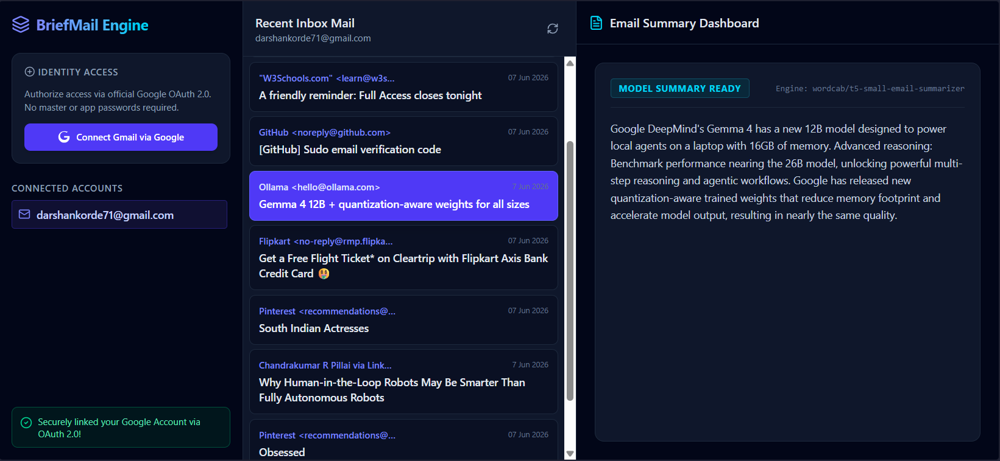
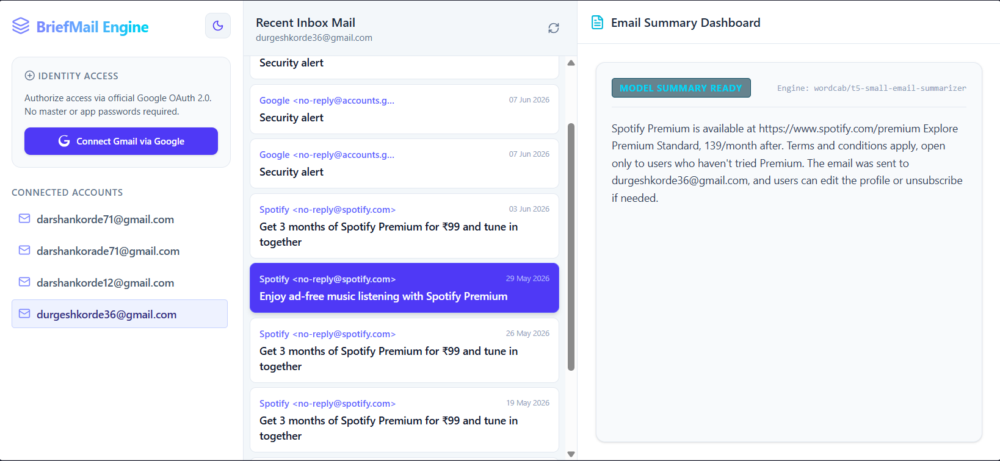

# BriefMail Engine

BriefMail Engine is a lightweight, full-stack email summarization web application powered by an open-source transformer pipeline. The application connects directly to the Gmail API to securely pull, decode, and condense multi-part inbox messages in real time.

## Key Features

* **AI-Powered Summarization:** Utilizes the specialized `wordcab/t5-small-email-summarizer` language model to strip down heavy text threads into precise summaries.
* **Secure Authorization:** Implements a credential-free, official Google OAuth 2.0 handshake via a FastAPI backend to seamlessly map mailbox configurations without storing passwords.
* **Real-Time Inbox Synchronization:** Fetches recent inbox updates on demand using high-performance, asynchronous endpoints.
* **Modern Responsive Interface:** Built with React and structured using a dark/light responsive layout switcher designed with Tailwind CSS.

## Tech Stack

* **Frontend:** React, Tailwind CSS, Lucide Icons, Vite
* **Backend:** FastAPI (Python), Pydantic Settings, Uvicorn
* **ML/AI:** Hugging Face Transformers, PyTorch
* **AI Model Pipeline:** [wordcab/t5-small-email-summarizer](https://huggingface.co/wordcab/t5-small-email-summarizer)



## Quick Start

> **Note:** This project is designed for local deployment. To use it, you must configure your own credentials via the Google Cloud Console.

## Prerequisites & Google Cloud Setup

1. Go to the [Google Cloud Console](https://console.cloud.google.com/).
2. Create a new project and enable the **Gmail API**.
3. Configure your **OAuth Consent Screen** and add the scope: `https://www.googleapis.com/auth/gmail.readonly`.
4. Create an **OAuth 2.0 Client ID** (Web Application type).
5. Set the **Authorized Redirect URI** exactly to:  
   `http://localhost:8000/api/auth/callback`

Navigate to your backend directory and create a `.env` file containing your Google Cloud Console credentials:

```text
1. Your Google Id's
GOOGLE_CLIENT_ID=your_google_client_id
GOOGLE_CLIENT_SECRET=your_google_client_secret
GOOGLE_REDIRECT_URI=http://localhost:8000/api/auth/callback

2. Install Dependencies
pip install -r requirements.txt
python -m uvicorn app.main:app --reload

3. Configure frontend
npm install
npm run dev
